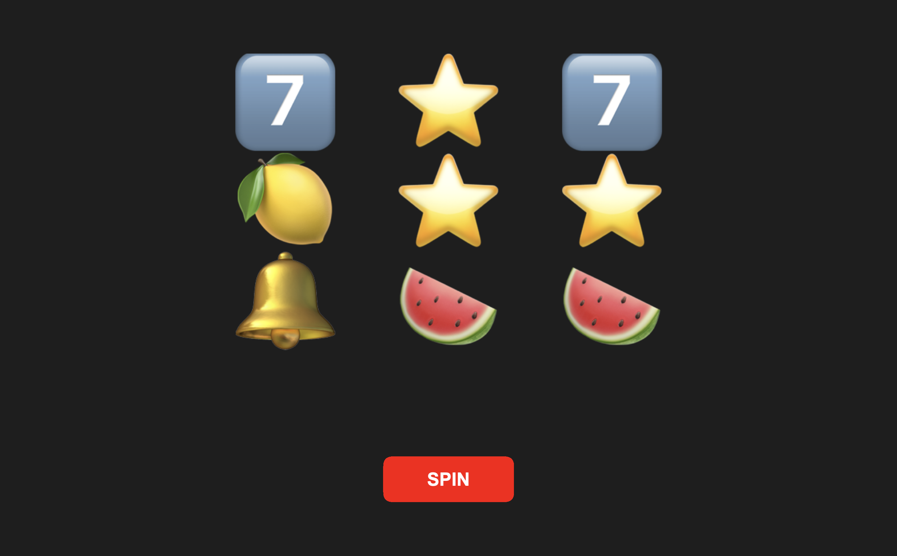
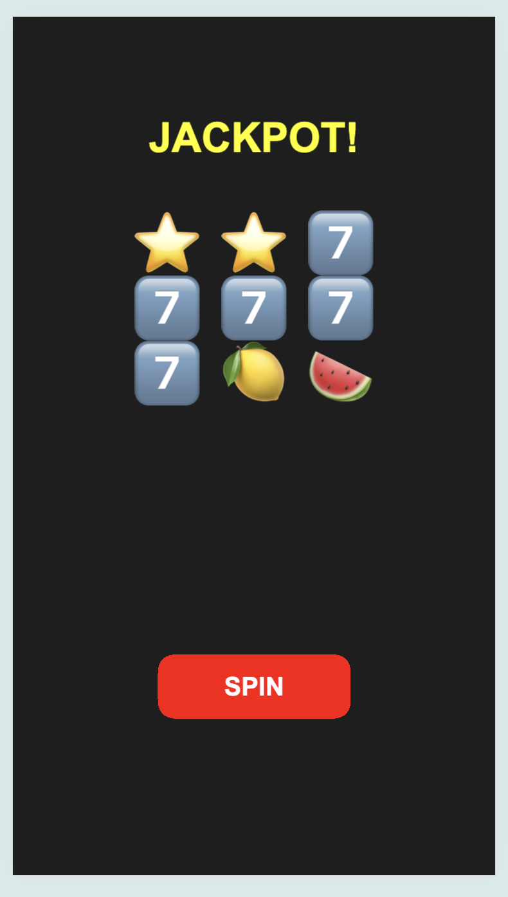

# AngularJS Slot Machine Game

This project is a **2D Slot Machine Game** built using **AngularJS** and **PixiJS**. It demonstrates how to use JavaScript and HTML5 to create a fun and interactive game that is both responsive and installable.

## Features
- **Slot Machine Gameplay**: Classic slot machine features such as spinning reels, stopping reels, and showing win/lose messages.
- **Responsive Design**: Adjusts to different screen sizes (desktop and mobile).
- **Cheat Code**: Press spacebar during spin to trigger a winning combination.

## Technologies Used
- **AngularJS**: Framework for building the front-end structure of the project.
- **PixiJS**: Rendering engine for 2D graphics and animations.
- **HTML5 & CSS3**: Structure and style the page.
- **JavaScript**: Core logic for game mechanics.

## Getting Started
### Prerequisites
Before you begin, ensure you have the following installed:
- [Node.js and npm](https://nodejs.org/en/download/)
- A modern web browser (Chrome, Firefox, etc.)

### Website Test
https://tonyc.info/html5project/slot-machine-game/ 

### Installation
1. **Clone the repository**:  
`git clone https://github.com/casterfile/simple-slot-machine-game`

2. **Navigate to the project directory**:  
`cd slot-machine-game`

3. **Install dependencies** (if you have a package.json, for any Node dependencies):  
`npm install`

4. **Run the Project**:  
You can open the `index.html` file directly in your web browser or use a local server to host it.

### Running a Local Server
To run the project using a local server, you can use any HTTP server. Here are a couple of options:
1. **Using Python (for Python 3)**:  
`python -m http.server`

2. **Using Node's `http-server`**:  
`npx http-server`

## How to Play
1. **Spin the Reels**: Click the "SPIN" button to start spinning.
2. **Stop the Reels**: Click "STOP" to stop the reels one by one.
3. **Winning Combination**: The goal is to align the same symbols in the middle row.
4. **Cheat Code**: Press the spacebar while spinning to stop and create a winning combination (777).

## Screenshot

### Desktop View

### Mobile View

Contact
•	Email: dev.anthonycastor@gmail.com
•	Website: www.tonyc.info